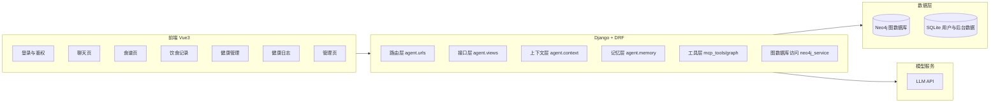

# 系统架构图说明模板（导师版）

## 1. 文档目的

用于答辩/评审时快速说明系统整体结构、核心模块职责与关键数据流。

## 2. 架构总览图（可直接替换）

## 3. 分层说明（填写版）

### 3.1 前端层

- 技术栈：
- 核心页面：
- 关键状态管理策略：

### 3.2 后端接口层

- 路由入口：
- 统一返回规范：
- 权限控制方式：

### 3.3 智能能力层

- 上下文构建策略（GSSC）：
- 记忆模块拆分（长期/情景/工作）：
- 工具调用与回退策略：

### 3.4 数据层

- Neo4j 节点/关系概览：
- 日志与关系数据写入策略：
- 一致性约束（例如唯一约束）：

## 4. 关键时序（建议展示 1~2 条）

- 场景 A：用户提问 -> 工具查询 -> 返回推荐
- 场景 B：导出菜谱 -> 记录饮食 -> 健康管理统计刷新

## 5. 架构亮点（填写版）

- 亮点 1：
- 亮点 2：
- 亮点 3：

## 6. 可扩展性说明（填写版）

- 新增页面如何接入：
- 新增接口如何接入：
- 新增图谱实体如何接入：
